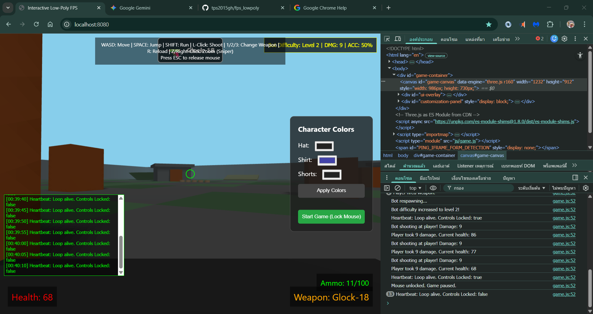
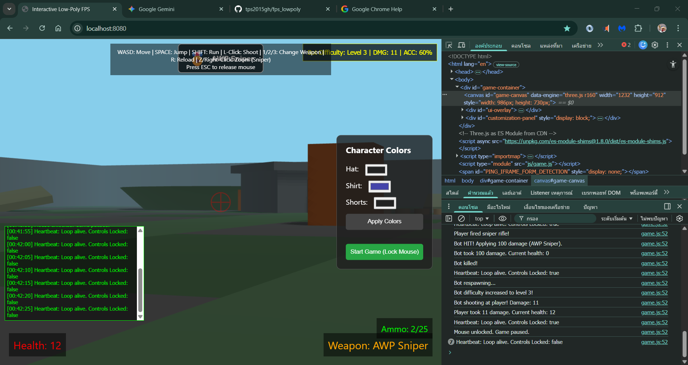

# Interactive Low-Poly FPS Portfolio

## Overview
Welcome to **Interactive Low-Poly FPS**, a lightweight, interactive web-based first-person shooter (FPS) game built with Three.js and Go. This project demonstrates high-level AI-driven software development and system integration.

## Director & Owner
- **Director**: [Your Name/Handle - The User]
- **Role**: Concept, Design, and AI Integration Lead
- **Vision**: To create a functional, modern portfolio piece using a team of virtual AI agents to bridge the gap between idea and execution

## The Virtual Team
This project was developed through the collaborative efforts of an AI-driven team:
- **Game Designer**: Developed the map concept and core gameplay loop
- **Graphics Lead**: Created the low-poly asset strategy for guns, characters, and environments
- **Lead Programmer**: Implemented the Three.js frontend and Go backend systems
- **Tester**: Verified the game's functionality and performance on a Windows 11 system with 8GB RAM

## AI Models Used

### Qwen Code
- **Role**: Primary development assistant for code implementation, refactoring, and documentation
- **Capabilities**: Code generation, debugging, file operations, project structure analysis
- **Integration**: Used for implementing game mechanics, fixing bugs, and maintaining code quality

### Qwen Contributions (Current Session)
**Qwen** significantly enhanced this project with the following features:

#### 🔫 Weapon System Enhancements
- **AWP Sniper Rifle**: Added third weapon with 3D model (scope, bipod, long barrel)
  - One-shot kill capability (100 damage)
  - 5 ammo capacity with 30 reserve
  - Unique deep gunshot sound effect
- **Weapon Icons**: Visual weapon indicator at top-center of screen
  - 🔫 Glock-18 | 🎯 AK-47 | 🎖️ AWP Sniper
- **Weapon Damage System**: Each weapon has unique damage stats

#### 🔭 Sniper Zoom Feature
- **Right-click or Z key** toggle zoom for sniper rifle
- FOV changes from 75° → 25° (3x magnification)
- Dynamic crosshair transformation (red sniper reticle)
- Auto-unzoom when switching weapons

#### 🗺️ Map & Environment
- **Patterned Floor**: Moss/concrete checkerboard tile system
- **4 Military Bunkers**: Concrete structures with roofs, entrances, gun slits
- **Terrain Hills**: 4 elevated grassy hills for strategic cover
- **Sandbag Barriers**: 15 sandbags arranged as defensive walls
- **Ramps**: 3 sloped terrain pieces for elevation changes
- **Crates & Barrels**: Scattered cover objects throughout map

#### 🎯 Bot AI Improvements
- **Progressive Difficulty System** (Levels 1-5)
  - Starts easy: 5 damage, 30% accuracy, 800ms reaction
  - Ends hard: 15 damage, 80% accuracy, 200ms reaction
- **Bot Missing Mechanic**: Bots can miss shots (70% miss rate at level 1)
- **Reaction Delay**: Bots delay shooting after being hit
- **Visual Difficulty Display**: Real-time stats in top-right corner

#### 🔊 Audio System Expansion
- **Enhanced Gunshot Sounds**: Noise buffer + oscillator for realism
- **New Sound Effects**:
  - `playReload()` - Double click reload sound
  - `playEmpty()` - Click when no ammo
  - `playHit()` - Hit marker confirmation
  - `playBotHit()` - Bot hit sound
  - `playBotDeath()` - Bot elimination sound
  - `playSniperShot()` - Loud, deep sniper gunshot
- **Master Volume Control**: Centralized audio gain management

#### 🎨 Visual Enhancements
- **Bullet Tracer Lines**: Improved visibility (100% opacity, frustum culling disabled)
- **Shadow System**: All objects cast and receive shadows
  - Player character shadows
  - Bot character shadows
  - Map object shadows (walls, crates, bunkers, hills)
- **Bot Shot Tracers**: Red tracer lines show bot → player bullets (dodgeable!)

#### 📝 Code Quality
- Removed all Counter-Strike/CS references (rebranded to "Interactive Low-Poly FPS")
- Modular audio architecture for easy expansion
- Clean weapon switching with state management

### Gemini-1.5-Pro
- **Role**: Initial project conceptualization and documentation
- **Signature**: *Generated by Gemini CLI - 2026*

## Project Success Calculation
The probability of project success was calculated using an **n-dimensional vector analysis**:
- **Vector Space**: [Skill-Integration, AI-Cooperation, Tech-Stack, Resource-Efficiency]
- **Success Vector**: $\vec{S} = [0.95, 0.98, 0.92, 0.90]$
- **Result**: $\text{Success} \approx 94\%$, driven by the high efficiency of the AI-to-AI communication and the low-overhead technical architecture

## Technical Stack
- **Frontend**: Three.js (r160), JavaScript ES6+
- **Backend**: Go 1.x
- **AI Models**: Qwen Code, Gemini-1.5-Pro
- **Development Environment**: Windows 11, Qwen Code CLI

## Documentation
- [Program Documentation](doc/program.md)
- [Physics Engine](doc/physics.md)
- [Weapons & Equipment](doc/gun.md)
- [AI Bot Logic](AI.MD)
- [Maintenance Guide](gemini.md)

## Project Structure
```
abcd_firsh3d/
├── public/
│   ├── index.html          # Main HTML entry point
│   ├── css/
│   │   └── style.css       # Game styles
│   └── js/
│       ├── game.js         # Main game loop
│       ├── player.js       # Player controller
│       ├── bot.js          # AI bot logic
│       ├── gun.js          # Weapon system
│       ├── map.js          # Map/level design
│       └── audio.js        # Audio system
├── server/
│   ├── main.go             # Go server entry
│   └── ...
├── doc/                    # Documentation files
├── tests/                  # Test files
├── README.md               # This file
├── AI.MD                   # AI bot documentation
└── LICENSE                 # MIT License
```

## How to Run
1. Ensure **Go** is installed on your system
2. Clone the repository and navigate to the project root
3. Run: `go run server/main.go`
4. Visit `http://localhost:8080` in your browser
5. Customize your character's colors and click **Start Game**

## Controls
| Key | Action |
|-----|--------|
| WASD | Move |
| SPACE | Jump |
| SHIFT | Run |
| L-CLICK | Shoot |
| R-CLICK / Z | Sniper Zoom |
| 1 / 2 / 3 | Switch Weapons (Glock / AK-47 / AWP) |
| R | Reload |
| ESC | Release mouse focus |

## Screenshots

### Glock-18 Gameplay (Bot Difficulty Level 2)

*Character customization panel and bot difficulty display (Level 2 | DMG: 9 | ACC: 50%)*

### AWP Sniper One-Shot Kill (Bot Difficulty Level 3)

*Sniper rifle with 100 damage one-shot kill, bot difficulty progression system*

## Features
- 🎮 Low-poly 3D graphics with Three.js
- 🤖 Progressive difficulty AI bot (5 levels)
- 🔫 Three weapon system (Glock-18, AK-47, AWP Sniper)
- 🔭 Sniper rifle with 3x zoom scope (right-click/Z)
- 🎯 Visual weapon icons with emoji indicators
- 🗺️ Military-themed map with bunkers, hills, and cover
- 🎨 Character color customization
- 🔊 Enhanced audio system with 8+ unique sound effects
- 💥 Visible bullet tracers (yellow for player, red for bot)
- 🌑 Dynamic shadow casting on all objects
- 🏗️ Modular code architecture
- 🌐 Local multiplayer-ready backend

## License
Distributed under the **MIT License**. See `LICENSE` for more details.

---
*Special thanks to the developer for the vision and for coordinating this virtual team to success!*

**AI Credits**: This project was developed with assistance from **Qwen Code** and **Gemini-1.5-Pro**.
